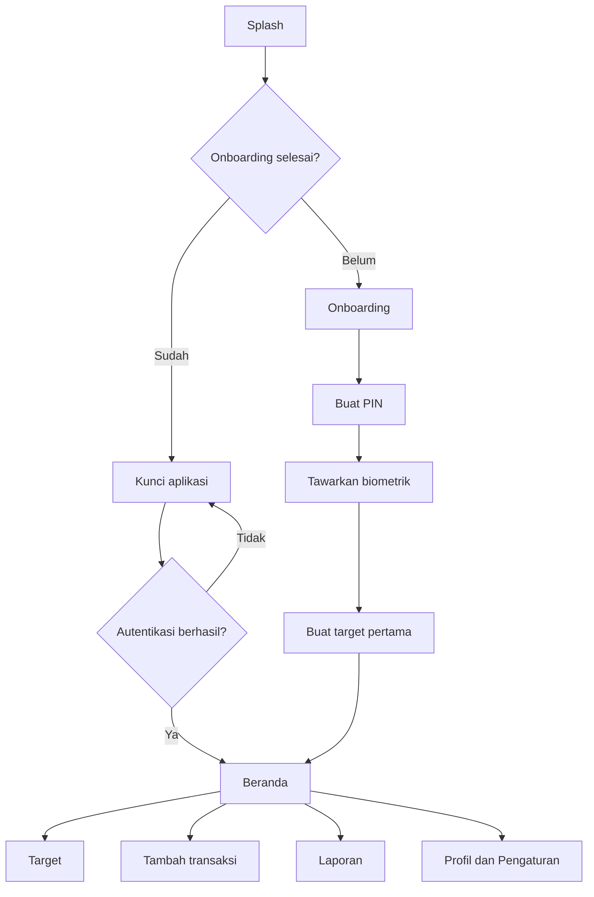
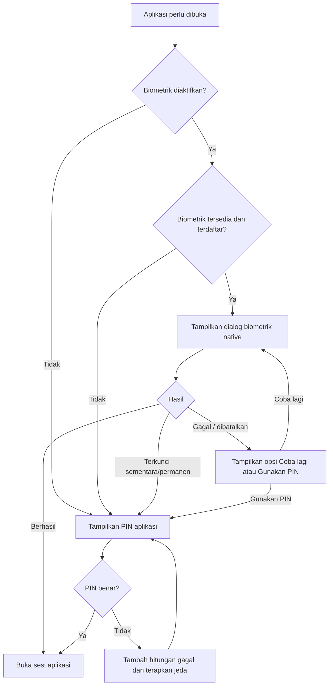

# Workflow Aplikasi Tabungan Uang Flutter

## 1. Informasi Dokumen

| Item | Keterangan |
|---|---|
| Nama sementara produk | Tabungin |
| Platform awal | Android dan iOS menggunakan Flutter |
| Jenis aplikasi | Pencatat dan pendamping target tabungan pribadi |
| Versi dokumen | 1.0 |
| Status | Blueprint produk dan pengembangan |
| Fokus keamanan | PIN aplikasi 6 digit dengan biometrik opsional |

Dokumen ini menjadi acuan untuk desain UI/UX, pengembangan Flutter, backend, pengujian, dan penentuan ruang lingkup MVP.

---

## 2. Tujuan Produk

Aplikasi membantu pengguna:

1. Menentukan tujuan keuangan yang jelas.
2. Menghitung jumlah yang perlu ditabung secara berkala.
3. Mencatat setoran dan penarikan tabungan.
4. Memantau progres setiap tujuan.
5. Membangun kebiasaan menabung melalui pengingat, streak, dan tantangan.
6. Melindungi informasi keuangan menggunakan PIN aplikasi dan biometrik.

### Keputusan ruang lingkup utama

Versi MVP **tidak menyimpan, menahan, atau memindahkan uang sungguhan**. Aplikasi mencatat tabungan yang secara fisik tetap berada di rekening bank, dompet digital, celengan, atau tempat lain milik pengguna.

Integrasi bank, pembayaran, dan transfer uang masuk ke fase lanjutan karena membutuhkan kerja sama penyedia layanan, keamanan tambahan, kepatuhan, serta kajian regulasi.

---

## 3. Prinsip Pengalaman Pengguna

1. **Sederhana:** pengguna dapat mencatat setoran maksimal dalam tiga langkah.
2. **Mendukung, bukan menghakimi:** kegagalan menabung tidak ditampilkan sebagai hukuman.
3. **Privat:** nominal dapat disembunyikan dan aplikasi otomatis terkunci.
4. **Fleksibel:** mendukung pendapatan tetap maupun tidak tetap.
5. **Transparan:** setiap perubahan saldo memiliki riwayat.
6. **Aman:** PIN tidak pernah disimpan sebagai teks biasa dan data sensitif tidak muncul di log.
7. **Offline-first:** fitur inti tetap dapat dipakai tanpa internet, kemudian disinkronkan saat koneksi tersedia.

---

## 4. Aktor Sistem

| Aktor | Peran |
|---|---|
| Pengguna baru | Melakukan onboarding, membuat PIN, dan membuat target pertama |
| Pengguna aktif | Mencatat setoran, memantau progres, dan mengatur target |
| Sistem aplikasi | Menghitung rencana, progres, streak, dan membuat notifikasi |
| Sistem biometrik perangkat | Memverifikasi sidik jari atau wajah tanpa memberikan data biometrik kepada aplikasi |
| Backend/cloud opsional | Menyimpan akun, sinkronisasi, backup, dan pemulihan data |
| Admin internal | Mengelola konten edukasi dan melihat data operasional yang tidak sensitif |

Admin tidak boleh dapat melihat PIN, data biometrik, token rahasia, atau data keuangan pengguna tanpa kewenangan dan pencatatan audit yang jelas.

---

## 5. Ruang Lingkup Fitur

### 5.1 MVP

- Onboarding singkat.
- Mode akun atau mode lokal sesuai keputusan produk.
- PIN aplikasi 6 digit.
- Biometrik opsional dengan PIN sebagai fallback.
- Membuat, mengubah, mengarsipkan, dan menyelesaikan target.
- Pencatatan setoran dan penarikan.
- Kalkulator rencana menabung.
- Dashboard dan grafik progres.
- Pengingat menabung.
- Riwayat transaksi.
- Penyembunyian nominal saldo.
- Backup dan sinkronisasi jika menggunakan akun/cloud.
- Ekspor data sederhana.

### 5.2 Fase lanjutan

- Tantangan menabung.
- Streak dan badge.
- Tabungan bersama.
- Mode amplop anggaran.
- Widget layar utama.
- Analisis pola menabung.
- Prediksi tanggal target tercapai.
- Impor mutasi atau integrasi bank resmi.
- Auto-rounding melalui mitra pembayaran.
- Rekomendasi cerdas yang tetap dapat dijelaskan kepada pengguna.

### 5.3 Di luar ruang lingkup MVP

- Menyimpan saldo uang pengguna.
- Transfer antarbank.
- Pembayaran QR.
- Pinjaman, paylater, atau pemberian saran investasi.
- Peringkat pengguna berdasarkan jumlah uang.

---

## 6. Struktur Navigasi

Navigasi utama menggunakan lima bagian:

1. **Beranda** — ringkasan saldo, target utama, aktivitas, dan tombol setoran.
2. **Target** — seluruh target aktif, selesai, dan diarsipkan.
3. **Tambah** — shortcut setoran, penarikan, atau target baru.
4. **Laporan** — grafik, konsistensi, dan ringkasan periode.
5. **Profil** — keamanan, notifikasi, data, tema, dan bantuan.



---

## 7. Workflow Utama Pengguna

## 7.1 Peluncuran aplikasi

### Trigger

Pengguna membuka aplikasi.

### Proses

1. Tampilkan splash screen singkat.
2. Muat konfigurasi lokal yang tidak sensitif.
3. Periksa apakah onboarding pernah diselesaikan.
4. Periksa status sesi dan kebijakan auto-lock.
5. Jangan menampilkan nominal, nama target, atau data pribadi sebelum autentikasi berhasil.
6. Arahkan pengguna:
   - Belum onboarding → halaman onboarding.
   - Sudah onboarding dan aplikasi terkunci → halaman autentikasi.
   - Sudah onboarding dan sesi masih valid → Beranda.

### Kondisi gagal

- Database lokal gagal dibuka → tampilkan layar pemulihan, jangan membuat database kosong secara otomatis.
- Data terenkripsi rusak → tawarkan pemulihan dari backup atau hubungi dukungan.
- Upgrade skema gagal → rollback migrasi dan pertahankan data lama.

---

## 7.2 Onboarding pengguna baru

### Urutan layar

1. **Nilai utama aplikasi**
   - Buat target.
   - Catat tabungan.
   - Bangun kebiasaan.
2. **Pilihan penggunaan data**
   - Jelaskan fungsi aplikasi dan kebijakan privasi secara ringkas.
   - Analytics non-esensial harus menggunakan persetujuan terpisah.
3. **Akun atau mode lokal**
   - Akun: mendukung sinkronisasi dan pemulihan.
   - Lokal: data hanya di perangkat kecuali pengguna mengekspor backup.
4. **Buat PIN aplikasi**.
5. **Aktifkan biometrik** jika tersedia.
6. **Atur preferensi dasar** seperti mata uang dan jadwal gajian opsional.
7. **Buat target pertama** atau lewati ke Beranda kosong.

### Aturan

- Onboarding dapat dilewati kecuali pembuatan PIN.
- Izin notifikasi diminta ketika manfaatnya sudah dijelaskan, bukan langsung saat splash.
- Biometrik bersifat opsional dan dapat diaktifkan nanti.
- Pengguna tetap dapat memakai aplikasi dengan PIN meskipun biometrik tidak tersedia.

---

## 7.3 Pembuatan PIN aplikasi

### Tujuan

PIN menjadi metode autentikasi dasar dan fallback ketika biometrik gagal.

### Urutan

1. Tampilkan alasan penggunaan PIN.
2. Pengguna memasukkan PIN 6 digit.
3. Tolak PIN lemah yang mudah ditebak, misalnya:
   - `000000`, `111111`, dan angka sama lainnya.
   - `123456`, `654321`, atau urutan sederhana.
   - Tanggal lahir jika informasi tersebut diketahui aplikasi.
4. Pengguna mengulangi PIN.
5. Jika kedua PIN tidak sama, kosongkan konfirmasi dan tampilkan pesan yang jelas.
6. Jika sama, buat salt acak dan hash PIN menggunakan algoritma derivasi kunci yang sesuai, misalnya Argon2id atau alternatif yang telah ditinjau tim keamanan.
7. Simpan hanya hasil hash, salt, parameter algoritma, dan metadata keamanan di penyimpanan aman perangkat.
8. Tandai setup keamanan selesai.
9. Lanjutkan ke penawaran biometrik.

### Larangan

- Jangan menyimpan PIN sebagai teks biasa.
- Jangan mengirim PIN ke analytics, crash reporting, log, atau clipboard.
- Jangan mengambil screenshot layar PIN.
- Jangan menampilkan digit PIN di app switcher.
- Jangan menggunakan PIN sebagai kunci enkripsi secara langsung tanpa derivasi kunci.

---

## 7.4 Aktivasi biometrik

### Prasyarat

- PIN aplikasi sudah dibuat.
- Perangkat mendukung autentikasi lokal.
- Minimal satu biometrik telah didaftarkan pada perangkat.
- Pengguna memberikan persetujuan eksplisit.

### Urutan

1. Sistem memeriksa dukungan autentikasi lokal.
2. Sistem memeriksa biometrik yang benar-benar sudah didaftarkan, bukan hanya keberadaan perangkat keras.
3. Jika tersedia, tampilkan layar manfaat dan tombol **Aktifkan biometrik**.
4. Panggil dialog biometrik native dari sistem operasi.
5. Gunakan autentikasi khusus biometrik (`biometricOnly: true`) agar fallback dapat dikendalikan oleh aplikasi.
6. Jika verifikasi berhasil:
   - Simpan preferensi `biometric_enabled = true` secara aman.
   - Catat waktu aktivasi tanpa menyimpan data biometrik.
   - Tampilkan konfirmasi berhasil.
7. Jika gagal atau dibatalkan:
   - Biometrik tetap nonaktif pada tahap setup.
   - Pengguna tetap dapat melanjutkan menggunakan PIN.

### Catatan penting

Aplikasi tidak menerima atau menyimpan sidik jari maupun wajah. Aplikasi hanya menerima hasil berhasil atau gagal dari sistem operasi.

---

## 7.5 Login: biometrik dengan fallback ke PIN

Ini adalah alur wajib sesuai kebutuhan produk.



### Perilaku layar login

1. Saat layar kunci terbuka dan biometrik aktif, aplikasi dapat memicu dialog biometrik satu kali secara otomatis.
2. Selalu sediakan tombol **Gunakan PIN**.
3. Setelah kegagalan biometrik biasa:
   - Tampilkan pesan “Biometrik belum dikenali”.
   - Berikan tombol **Coba lagi** dan **Gunakan PIN**.
4. Setelah pengguna membatalkan dialog:
   - Jangan langsung memunculkan dialog berulang kali.
   - Kembali ke layar kunci dan biarkan pengguna memilih metode.
5. Saat biometrik terkunci oleh sistem:
   - Jangan terus mencoba biometrik.
   - Alihkan ke PIN aplikasi.
6. Saat perangkat tidak lagi memiliki biometrik terdaftar:
   - Nonaktifkan biometrik untuk sesi berikutnya.
   - Minta PIN.
   - Tawarkan aktivasi ulang setelah login.
7. Setelah PIN benar, pengguna masuk meskipun biometrik gagal.

### Status hasil biometrik yang harus ditangani

| Status | Respons aplikasi |
|---|---|
| Berhasil | Buka sesi dan arahkan ke tujuan awal |
| Tidak cocok | Tawarkan coba lagi atau PIN |
| Dibatalkan pengguna | Tetap di layar kunci; jangan loop otomatis |
| Dibatalkan sistem/background | Coba lagi setelah aplikasi aktif atau tampilkan layar kunci |
| Tidak ada hardware | Gunakan PIN |
| Belum ada biometrik terdaftar | Gunakan PIN dan tampilkan panduan pengaturan |
| Lockout sementara | Gunakan PIN dan sembunyikan tombol biometrik sementara |
| Lockout permanen | Gunakan PIN; arahkan pengguna memulihkan biometrik melalui pengaturan perangkat |
| Kesalahan tidak dikenal | Gunakan PIN dan catat kode error yang sudah disanitasi |

### Pengamanan PIN gagal

Kebijakan awal yang disarankan:

| Jumlah kegagalan PIN berturut-turut | Respons |
|---:|---|
| 1–4 | Pesan kesalahan tanpa menyebut digit mana yang salah |
| 5 | Kunci input selama 30 detik |
| 6 | Kunci input selama 1 menit |
| 7 | Kunci input selama 5 menit |
| 8 atau lebih | Kunci input selama 15 menit dan tampilkan pemulihan akun |

Aturan tambahan:

- Hitungan kegagalan dan waktu lockout harus tahan terhadap restart aplikasi.
- Mengubah jam perangkat tidak boleh menghapus lockout; gunakan waktu monotonic bila tersedia dan validasi server untuk mode akun.
- Biometrik tidak boleh digunakan untuk melewati lockout PIN jika terdapat indikasi risiko atau perubahan keamanan perangkat.
- Jangan menghapus data otomatis hanya karena PIN salah.

---

## 7.6 Lupa PIN dan pemulihan akses

### Mode menggunakan akun/cloud

1. Pengguna memilih **Lupa PIN**.
2. Aplikasi meminta verifikasi identitas akun melalui mekanisme yang ditentukan, misalnya tautan email, OTP, passkey, atau login ulang.
3. Setelah identitas berhasil diverifikasi, sistem mencabut sesi perangkat lama yang relevan.
4. Pengguna membuat PIN baru dan mengonfirmasinya.
5. Biometrik dinonaktifkan sementara.
6. Pengguna login menggunakan PIN baru.
7. Aplikasi menawarkan aktivasi biometrik kembali.
8. Kirim pemberitahuan keamanan bahwa PIN diubah.

### Mode lokal tanpa akun

Pilihan pemulihan harus dijelaskan sejak onboarding:

- Jika biometrik masih dapat memverifikasi pengguna, izinkan reset PIN setelah biometrik berhasil dan pemeriksaan risiko lolos.
- Jika biometrik tidak dapat digunakan, pulihkan dari file backup terenkripsi dengan kredensial backup.
- Jika tidak ada akun, biometrik, atau backup yang valid, satu-satunya pilihan adalah reset data lokal setelah konfirmasi berlapis.

Jangan menjanjikan pemulihan data lokal jika produk tidak memiliki cara teknis untuk memverifikasi pemiliknya.

---

## 7.7 Auto-lock dan siklus hidup aplikasi

### Pemicu penguncian

- Aplikasi baru dibuka.
- Aplikasi kembali dari background setelah batas waktu.
- Pengguna menekan tombol **Kunci sekarang**.
- Pengaturan keamanan diubah.
- PIN berhasil diubah.
- Aplikasi mendeteksi sesi atau kondisi perangkat berisiko.

### Pilihan batas waktu

- Langsung saat aplikasi masuk background.
- Setelah 30 detik.
- Setelah 1 menit.
- Setelah 5 menit.
- Setelah 15 menit.

Default yang disarankan adalah 1 menit. Untuk tindakan sensitif seperti ekspor data, mengubah PIN, mengaktifkan sinkronisasi, atau menghapus akun, minta autentikasi ulang walaupun sesi masih aktif.

---

## 7.8 Beranda

### Komponen

1. Sapaan dan tanggal.
2. Total seluruh tabungan dengan tombol tampil/sembunyikan.
3. Target prioritas dan persentase progres.
4. Tombol **Tambah setoran**.
5. Ringkasan bulan ini.
6. Rekomendasi tindakan berikutnya.
7. Aktivitas terbaru.
8. Pengingat yang akan datang.

### Keadaan tampilan

- **Kosong:** ajak membuat target pertama.
- **Aktif:** tampilkan maksimal tiga target utama.
- **Target terlambat:** tawarkan penyesuaian rencana tanpa bahasa negatif.
- **Semua selesai:** tampilkan perayaan dan ajakan membuat target baru.
- **Offline:** semua fungsi lokal tetap aktif; tampilkan status sinkronisasi secara halus.

---

## 7.9 Membuat target tabungan

### Data wajib

- Nama target.
- Nominal target lebih besar dari nol.
- Saldo awal, default nol.
- Frekuensi menabung: harian, mingguan, bulanan, atau fleksibel.

### Data opsional

- Tenggat waktu.
- Gambar atau ikon.
- Kategori.
- Prioritas.
- Lokasi penyimpanan uang, misalnya rekening, e-wallet, atau tunai.
- Catatan.
- Pengingat.

### Urutan

1. Pengguna memilih **Buat target**.
2. Isi nama, kategori, dan visual.
3. Masukkan nominal target dan saldo awal.
4. Pilih tenggat atau mode tanpa tenggat.
5. Sistem menghitung kebutuhan setoran berkala.
6. Pengguna memilih frekuensi dan jadwal.
7. Tampilkan ringkasan sebelum disimpan.
8. Simpan target dan buat jadwal pengingat jika disetujui.
9. Arahkan ke detail target.

### Validasi

- Nominal target harus lebih besar daripada atau sama dengan saldo awal.
- Tenggat tidak boleh berada di masa lalu.
- Nama target tidak boleh hanya berisi spasi.
- Nominal menggunakan integer satuan mata uang untuk menghindari kesalahan floating point.
- Perubahan mata uang tidak mengonversi nominal lama secara diam-diam.

---

## 7.10 Kalkulator rencana menabung

### Input

- Target nominal.
- Saldo saat ini.
- Tanggal mulai.
- Tenggat.
- Frekuensi setoran.
- Hari pilihan pengguna, jika mingguan atau bulanan.

### Perhitungan dasar

```text
sisa_target = nominal_target - saldo_saat_ini
jumlah_periode = jumlah periode valid sampai tenggat
setoran_disarankan = pembulatan_ke_atas(sisa_target / jumlah_periode)
```

### Aturan

- Jika tidak ada tenggat, pengguna menentukan nominal rutin dan sistem menghitung perkiraan tanggal selesai.
- Jika pengguna tertinggal, sistem menawarkan:
  1. Menaikkan setoran berikutnya.
  2. Memperpanjang tenggat.
  3. Menurunkan target.
  4. Membiarkan rencana tanpa perubahan.
- Sistem tidak boleh mengubah target secara otomatis tanpa konfirmasi.

---

## 7.11 Menambah setoran

### Urutan cepat

1. Tekan **Tambah** atau **Tambah setoran**.
2. Pilih target jika belum ditentukan.
3. Masukkan nominal.
4. Pilih tanggal dan sumber dana opsional.
5. Tambahkan catatan opsional.
6. Tampilkan saldo setelah transaksi.
7. Konfirmasi.
8. Simpan transaksi secara atomik.
9. Perbarui saldo, progres, streak, laporan, dan jadwal pengingat.
10. Jika milestone tercapai, tampilkan perayaan singkat.

### Aturan

- Nominal harus lebih besar dari nol.
- Setoran yang membuat saldo melewati target diperbolehkan setelah konfirmasi.
- Jika transaksi gagal disimpan, saldo target tidak boleh berubah.
- Tombol simpan harus mencegah transaksi ganda akibat ketukan berulang.
- Pengeditan transaksi lama harus menghitung ulang saldo dan progres.

---

## 7.12 Penarikan tabungan

### Urutan

1. Buka target dan pilih **Tarik tabungan**.
2. Masukkan nominal dan alasan.
3. Tampilkan dampak terhadap progres dan estimasi tanggal selesai.
4. Jika anti-impulse mode aktif, jalankan waktu tunggu sesuai pengaturan.
5. Minta autentikasi ulang untuk nominal atau tindakan yang dianggap sensitif.
6. Konfirmasi penarikan.
7. Simpan transaksi dan hitung ulang rencana.

### Validasi

- Penarikan tidak boleh melebihi saldo target kecuali produk mendukung saldo negatif secara eksplisit.
- Pengguna boleh membatalkan selama proses.
- Jangan menggunakan pesan yang mempermalukan pengguna.

---

## 7.13 Target tercapai

1. Sistem mendeteksi saldo sama dengan atau melebihi nominal target.
2. Tampilkan perayaan dan ringkasan perjalanan.
3. Berikan pilihan:
   - Tandai selesai.
   - Tetap lanjut menabung.
   - Naikkan nominal target.
   - Pindahkan ke arsip.
4. Jika selesai, hentikan pengingat setoran untuk target tersebut.
5. Simpan tanggal pencapaian.
6. Jangan menghapus riwayat transaksi.

---

## 7.14 Mengubah, mengarsipkan, dan menghapus target

### Ubah

- Pengguna dapat mengganti nama, visual, target nominal, tenggat, prioritas, dan pengingat.
- Tampilkan dampak perubahan terhadap setoran berkala.

### Arsipkan

- Target hilang dari daftar aktif tetapi riwayat tetap tersedia.
- Pengguna dapat memulihkannya.

### Hapus

1. Tampilkan jumlah transaksi yang akan terdampak.
2. Minta konfirmasi eksplisit.
3. Untuk data tersinkronisasi, gunakan soft delete selama masa pemulihan.
4. Sediakan **Batalkan** sesaat setelah penghapusan bila memungkinkan.
5. Tindakan permanen memerlukan autentikasi ulang.

---

## 7.15 Pengingat dan notifikasi

### Jenis

- Jadwal menabung.
- Target hampir jatuh tempo.
- Ringkasan mingguan.
- Milestone tercapai.
- Streak hampir terputus.
- Notifikasi keamanan.

### Alur izin

1. Jelaskan manfaat pengingat di dalam aplikasi.
2. Pengguna memilih jadwal.
3. Baru minta izin notifikasi sistem.
4. Jika ditolak, aplikasi tetap berfungsi dan menampilkan cara mengaktifkannya lewat pengaturan.

### Aturan privasi

- Default notifikasi layar kunci tidak menampilkan nominal.
- Sediakan pilihan tampilan: lengkap, sembunyikan nominal, atau pesan generik.
- Hindari notifikasi berlebihan; batasi frekuensi dan sediakan quiet hours.

---

## 7.16 Laporan

### Filter

- Mingguan, bulanan, tahunan, atau rentang khusus.
- Semua target atau satu target.
- Setoran, penarikan, dan saldo bersih.

### Informasi

- Total setoran.
- Total penarikan.
- Perubahan bersih.
- Rata-rata setoran.
- Persentase target tercapai.
- Hari atau periode paling konsisten.
- Perbandingan dengan periode sebelumnya.

Insight harus berasal dari data yang jelas dan dapat dijelaskan. Hindari klaim seperti “keuangan Anda sehat” tanpa dasar yang transparan.

---

## 7.17 Ekspor, backup, dan sinkronisasi

### Ekspor

1. Pengguna memilih format CSV, PDF ringkasan, atau backup terenkripsi.
2. Aplikasi meminta autentikasi ulang.
3. Pengguna memilih rentang dan target.
4. File dibuat di lokasi sementara yang terlindungi.
5. Pengguna memilih tujuan berbagi atau penyimpanan.
6. File sementara dibersihkan setelah selesai.

### Sinkronisasi

- Setiap perubahan memiliki ID unik, versi, dan waktu perubahan.
- Operasi offline masuk ke antrean sinkronisasi.
- Hindari duplikasi transaksi menggunakan idempotency key.
- Konflik sederhana diselesaikan berdasarkan versi; konflik nominal atau transaksi meminta tinjauan pengguna.
- Penghapusan menggunakan tombstone agar tidak muncul kembali dari perangkat lain.
- Status sinkronisasi: tersinkron, menunggu, gagal, atau konflik.

---

## 7.18 Pengaturan keamanan

Menu **Profil → Keamanan** berisi:

- Ubah PIN.
- Aktifkan/nonaktifkan biometrik.
- Pilih waktu auto-lock.
- Tampilkan perangkat aktif jika memakai akun.
- Keluar dari semua perangkat.
- Sembunyikan nominal secara default.
- Kunci sekarang.
- Riwayat aktivitas keamanan.

### Ubah PIN

1. Minta PIN lama atau autentikasi ulang yang setara.
2. Masukkan PIN baru.
3. Konfirmasi PIN baru.
4. Simpan hash baru secara atomik.
5. Cabut sesi berisiko bila memakai akun.
6. Nonaktifkan biometrik sementara dan tawarkan aktivasi ulang.
7. Kirim notifikasi keamanan.

### Nonaktifkan biometrik

1. Minta PIN aplikasi.
2. Ubah preferensi biometrik menjadi nonaktif.
3. Hapus material kunci biometrik yang tidak lagi diperlukan.
4. Login berikutnya langsung menggunakan PIN.

---

## 8. Status dan Model Data Inti

## 8.1 UserSettings

| Field | Tipe konseptual | Keterangan |
|---|---|---|
| user_id | UUID/string | Identitas pengguna |
| currency | string | Contoh: IDR |
| locale | string | Contoh: id-ID |
| biometric_enabled | boolean | Preferensi biometrik |
| balance_hidden | boolean | Status tampilan nominal |
| auto_lock_duration | integer | Durasi dalam detik |
| notification_privacy | enum | full, hidden_amount, generic |
| onboarding_completed | boolean | Status onboarding |

## 8.2 SecurityCredential

| Field | Tipe konseptual | Keterangan |
|---|---|---|
| pin_hash | bytes/string | Hash PIN, bukan PIN asli |
| pin_salt | bytes/string | Salt acak unik |
| kdf_algorithm | string | Algoritma derivasi kunci |
| kdf_parameters | object | Parameter cost yang dapat dimigrasikan |
| failed_attempts | integer | Kegagalan berturut-turut |
| locked_until | timestamp | Batas lockout |
| pin_changed_at | timestamp | Waktu perubahan terakhir |

## 8.3 SavingGoal

| Field | Tipe konseptual | Keterangan |
|---|---|---|
| id | UUID | Identitas target |
| name | string | Nama target |
| target_amount | integer | Nominal dalam satuan mata uang terkecil |
| current_amount | integer/cache | Saldo hasil agregasi transaksi |
| start_date | date | Tanggal mulai |
| target_date | date/null | Tenggat opsional |
| frequency | enum | daily, weekly, monthly, flexible |
| category | string/null | Kategori target |
| priority | integer | Prioritas |
| status | enum | active, completed, archived, deleted |
| created_at | timestamp | Waktu dibuat |
| updated_at | timestamp | Waktu diperbarui |

## 8.4 SavingTransaction

| Field | Tipe konseptual | Keterangan |
|---|---|---|
| id | UUID | Identitas transaksi |
| goal_id | UUID | Target pemilik transaksi |
| type | enum | deposit atau withdrawal |
| amount | integer | Nominal positif; arah ditentukan oleh type |
| transaction_date | timestamp | Waktu transaksi pengguna |
| note | string/null | Catatan |
| source | string/null | Sumber/lokasi dana |
| idempotency_key | UUID | Pencegah duplikasi |
| sync_status | enum | synced, pending, failed, conflict |
| created_at | timestamp | Waktu dibuat |
| updated_at | timestamp | Waktu diperbarui |
| deleted_at | timestamp/null | Soft delete |

## 8.5 Reminder

| Field | Tipe konseptual | Keterangan |
|---|---|---|
| id | UUID | Identitas pengingat |
| goal_id | UUID/null | Target terkait |
| schedule_type | enum | daily, weekly, monthly, custom |
| schedule_value | object | Hari dan waktu |
| enabled | boolean | Status aktif |
| next_run_at | timestamp | Jadwal berikutnya |

### Sumber kebenaran saldo

Riwayat transaksi adalah sumber kebenaran. `current_amount` boleh digunakan sebagai cache untuk performa, tetapi harus dapat dihitung ulang dari transaksi aktif.

---

## 9. State Management dan Lapisan Aplikasi Flutter

Struktur yang disarankan bersifat modular per fitur:

```text
lib/
  app/
    routing/
    theme/
    bootstrap/
  core/
    auth/
    security/
    storage/
    networking/
    notifications/
    errors/
  features/
    onboarding/
    lock/
    dashboard/
    goals/
    transactions/
    reports/
    settings/
  shared/
    widgets/
    formatters/
    validators/
```

Setiap fitur idealnya dipisahkan menjadi:

- Presentation: screen, widget, dan controller/state.
- Domain: entity, use case, serta aturan bisnis.
- Data: repository, database lokal, dan API.

### State global minimum

- `AppLifecycleState`: foreground/background.
- `SessionState`: locked/unlocked/expired.
- `AuthMethodState`: biometric/pin.
- `SyncState`: idle/syncing/offline/error/conflict.
- `PrivacyState`: nominal terlihat atau tersembunyi.

Pemilihan Riverpod, Bloc, atau pendekatan lain dapat disesuaikan dengan kemampuan tim. Aturan bisnis tidak boleh bergantung langsung pada widget.

---

## 10. Penyimpanan dan Keamanan Teknis

### Data yang disimpan di secure storage/keystore/keychain

- Token sesi dan refresh token.
- Material kunci enkripsi.
- Hash dan salt PIN untuk mode lokal jika desain keamanan telah ditinjau.
- Flag keamanan yang tidak boleh mudah dimanipulasi.

### Data di database lokal terenkripsi

- Target.
- Transaksi.
- Pengingat.
- Preferensi yang mengandung informasi pribadi.
- Antrean sinkronisasi.

### Data yang tidak boleh disimpan

- Template wajah.
- Data sidik jari.
- PIN asli.
- Password asli.
- Token rahasia di log.

### Rekomendasi implementasi biometrik Flutter

- Gunakan paket resmi Flutter `local_auth` yang kompatibel dengan versi Flutter proyek.
- Periksa `canCheckBiometrics` dan `getAvailableBiometrics()` sebelum menawarkan fitur.
- Gunakan `biometricOnly: true` karena produk menginginkan fallback ke PIN aplikasi yang dikendalikan sendiri.
- Tangani kondisi aplikasi berpindah ke background saat dialog autentikasi aktif.
- Gunakan dialog native; jangan membuat dialog sidik jari palsu di UI Flutter.
- Konfigurasi izin dan persyaratan platform Android/iOS sesuai dokumentasi paket.

### Perlindungan UI

- Kaburkan atau tutup layar aplikasi saat tampil di recent apps/app switcher.
- Nonaktifkan screenshot pada layar sensitif jika sesuai dengan kebutuhan platform dan aksesibilitas.
- Jangan menyertakan nominal dalam push payload jika tidak diperlukan.
- Bersihkan controller input PIN setelah digunakan.
- Masking PIN harus konsisten dan tidak membocorkan panjang input melalui animasi yang berlebihan.

---

## 11. Penanganan Error

Gunakan pesan yang menjelaskan tindakan berikutnya.

| Situasi | Pesan yang disarankan | Tindakan |
|---|---|---|
| Biometrik tidak cocok | Biometrik belum dikenali | Coba lagi / Gunakan PIN |
| Biometrik terkunci | Biometrik sementara tidak tersedia | Gunakan PIN |
| PIN salah | PIN belum tepat | Coba lagi setelah jeda bila perlu |
| Tidak ada internet | Anda sedang offline; perubahan akan disinkronkan nanti | Lanjutkan secara lokal |
| Simpan transaksi gagal | Transaksi belum tersimpan | Coba lagi tanpa mengubah saldo |
| Sinkronisasi konflik | Ada perubahan berbeda pada perangkat lain | Tinjau perubahan |
| Izin notifikasi ditolak | Pengingat sistem belum aktif | Buka pengaturan / Nanti |
| Database bermasalah | Data tidak dapat dibuka dengan aman | Pulihkan backup / Hubungi dukungan |

Error teknis rinci disimpan hanya dalam log yang sudah disanitasi. Pengguna mendapat kode referensi, bukan stack trace.

---

## 12. Analytics dan Event Produk

Analytics harus menghindari nominal, nama target, catatan, PIN, dan data pribadi.

Event yang diperbolehkan secara konseptual:

- `onboarding_started`
- `onboarding_completed`
- `pin_setup_completed`
- `biometric_opt_in`
- `biometric_auth_result` dengan kategori umum, bukan detail biometrik
- `goal_created`
- `deposit_recorded`
- `withdrawal_recorded`
- `goal_completed`
- `reminder_enabled`
- `export_started`
- `sync_failed` dengan kode error yang disanitasi

Contoh data yang dilarang dalam analytics:

- Nominal transaksi.
- Nama target “Biaya operasi ibu”.
- Catatan transaksi.
- PIN atau hash PIN.
- Alamat email mentah jika tidak diperlukan.

---

## 13. Acceptance Criteria

## 13.1 Autentikasi

- [ ] Pengguna wajib membuat dan mengonfirmasi PIN 6 digit.
- [ ] PIN tidak disimpan sebagai teks biasa.
- [ ] Biometrik hanya ditawarkan jika tersedia dan telah didaftarkan.
- [ ] Pengguna dapat menolak biometrik dan tetap masuk dengan PIN.
- [ ] Jika biometrik berhasil, aplikasi terbuka.
- [ ] Jika biometrik gagal, pengguna dapat mencoba lagi atau menggunakan PIN.
- [ ] Jika biometrik dibatalkan, dialog tidak muncul dalam loop.
- [ ] Jika biometrik lockout, aplikasi langsung menyediakan PIN.
- [ ] Setelah PIN benar, pengguna dapat masuk walaupun biometrik gagal.
- [ ] Percobaan PIN dibatasi dengan progressive lockout.
- [ ] Status lockout tetap berlaku setelah aplikasi direstart.
- [ ] Aplikasi mengunci kembali sesuai waktu auto-lock.
- [ ] Tindakan sensitif meminta autentikasi ulang.

## 13.2 Target dan transaksi

- [ ] Pengguna dapat membuat target dengan nominal valid.
- [ ] Perhitungan setoran berkala sesuai sisa target dan jumlah periode.
- [ ] Setoran memperbarui saldo dan progres tepat satu kali.
- [ ] Penarikan tidak dapat melebihi saldo tanpa aturan khusus.
- [ ] Mengedit atau menghapus transaksi menghitung ulang saldo.
- [ ] Target yang tercapai dapat diselesaikan atau dilanjutkan.
- [ ] Pengarsipan tidak menghapus riwayat.

## 13.3 Privasi dan keandalan

- [ ] Nominal dapat disembunyikan.
- [ ] Notifikasi dapat menyembunyikan nominal.
- [ ] Data sensitif tidak muncul di log atau analytics.
- [ ] Operasi simpan transaksi bersifat atomik.
- [ ] Aplikasi tetap dapat mencatat transaksi saat offline.
- [ ] Sinkronisasi tidak menciptakan transaksi ganda.
- [ ] Pengguna dapat mengekspor atau menghapus datanya.

---

## 14. Skenario Pengujian Kritis

### Autentikasi biometrik dan PIN

1. Biometrik tersedia, aktif, dan berhasil.
2. Biometrik gagal satu kali lalu berhasil.
3. Biometrik gagal lalu pengguna memilih PIN.
4. Pengguna membatalkan dialog biometrik.
5. Aplikasi masuk background saat dialog biometrik terbuka.
6. Biometrik mengalami temporary lockout.
7. Biometrik mengalami permanent lockout.
8. Pengguna menghapus semua biometrik dari pengaturan perangkat.
9. Pengguna menambahkan biometrik baru setelah fitur diaktifkan.
10. Perangkat tidak mendukung biometrik.
11. PIN salah hingga progressive lockout aktif.
12. Aplikasi direstart selama lockout PIN.
13. Jam perangkat diubah selama lockout.
14. PIN diubah lalu login dengan PIN baru.
15. Biometrik dinonaktifkan lalu aplikasi dibuka kembali.
16. Pemulihan lupa PIN pada mode akun.
17. Pemulihan lupa PIN pada mode lokal.

### Target dan transaksi

1. Membuat target tanpa tenggat.
2. Membuat target dengan tenggat sangat dekat.
3. Saldo awal sama dengan target.
4. Setoran melewati nominal target.
5. Tombol simpan diketuk berulang kali.
6. Aplikasi ditutup saat transaksi sedang disimpan.
7. Penarikan sama dengan seluruh saldo.
8. Edit transaksi lama setelah banyak transaksi baru.
9. Hapus transaksi dan pulihkan melalui undo.
10. Konflik sinkronisasi pada dua perangkat.
11. Perhitungan pada pergantian bulan, tahun kabisat, dan zona waktu.
12. Nominal sangat besar serta format mata uang Indonesia.

### Aksesibilitas

1. Semua tombol memiliki semantic label.
2. Layar dapat digunakan dengan pembaca layar.
3. PIN pad tidak bergantung pada warna saja.
4. Teks tetap terbaca pada ukuran font besar.
5. Animasi perayaan mengikuti pengaturan reduce motion.
6. Kontras memenuhi standar aksesibilitas yang dipilih tim.

---

## 15. Tahapan Pengembangan

### Sprint 0 — Fondasi

- Finalisasi kebutuhan dan desain.
- Setup proyek Flutter dan environment.
- Routing, tema, error handling, dan struktur modul.
- Pemilihan database lokal, secure storage, backend, dan state management.
- Threat modeling awal.

### Sprint 1 — Keamanan dan onboarding

- Onboarding.
- Pembuatan serta verifikasi PIN.
- Biometrik dan seluruh fallback state.
- Lock screen, auto-lock, dan lifecycle.
- Pengujian perangkat Android/iOS nyata.

### Sprint 2 — Target tabungan

- CRUD target.
- Kalkulator rencana.
- Detail target.
- Status aktif, selesai, dan arsip.

### Sprint 3 — Transaksi

- Setoran dan penarikan.
- Riwayat.
- Perhitungan saldo atomik.
- Edit, hapus, dan undo.

### Sprint 4 — Dashboard dan laporan

- Beranda.
- Grafik progres.
- Ringkasan periode.
- Penyembunyian nominal.

### Sprint 5 — Pengingat dan data

- Notifikasi lokal.
- Quiet hours dan privasi notifikasi.
- Ekspor.
- Backup/sinkronisasi jika masuk MVP.

### Sprint 6 — Hardening dan rilis

- Audit keamanan.
- Pengujian migrasi database.
- Pengujian offline dan konflik.
- Pengujian aksesibilitas.
- Crash monitoring yang sudah disanitasi.
- Beta tertutup, perbaikan, dan rilis bertahap.

---

## 16. Definition of Done

Sebuah fitur dianggap selesai jika:

1. Acceptance criteria terpenuhi.
2. Unit test aturan bisnis tersedia.
3. Widget/integration test untuk alur utama tersedia.
4. Error, empty, loading, offline, dan success state sudah ditangani.
5. Tidak ada data sensitif di log maupun analytics.
6. UI diuji pada ukuran layar kecil dan besar.
7. Aksesibilitas dasar diperiksa.
8. Dokumentasi teknis diperbarui.
9. Code review dan pemeriksaan keamanan selesai.
10. QA di perangkat Android dan iOS nyata lulus.

---

## 17. Risiko dan Mitigasi

| Risiko | Dampak | Mitigasi |
|---|---|---|
| Pengguna lupa PIN | Kehilangan akses | Sediakan pemulihan akun atau backup terenkripsi yang dijelaskan sejak awal |
| Biometrik tidak tersedia | Tidak bisa login cepat | PIN selalu menjadi metode dasar |
| PIN mudah ditebak | Akses tidak sah | PIN 6 digit, blok PIN lemah, rate limiting, dan secure storage |
| Transaksi tercatat dua kali | Saldo salah | Idempotency key dan tombol simpan satu kali |
| Data hilang saat migrasi | Kehilangan kepercayaan | Backup, migrasi transaksional, dan rollback |
| Notifikasi membocorkan nominal | Risiko privasi | Default sembunyikan nominal |
| Konflik data banyak perangkat | Saldo tidak konsisten | Versioning, tombstone, dan resolusi konflik |
| Scope berkembang menjadi dompet digital | Risiko regulasi dan keamanan | Tetapkan MVP sebagai tracker dan lakukan kajian terpisah sebelum integrasi uang nyata |

---

## 18. Keputusan yang Masih Perlu Ditetapkan

Sebelum implementasi dimulai, tim perlu memutuskan:

1. Apakah MVP menggunakan akun/cloud atau sepenuhnya lokal.
2. Metode pemulihan lupa PIN.
3. Apakah backup terenkripsi masuk MVP.
4. Database lokal dan strategi enkripsinya.
5. Backend dan metode autentikasi akun.
6. State management Flutter.
7. Batas waktu auto-lock default.
8. Apakah screenshot diblokir pada seluruh aplikasi atau hanya layar sensitif.
9. Kebijakan retensi soft delete.
10. Negara peluncuran dan kebutuhan kepatuhan yang berlaku.

Rekomendasi awal: gunakan akun/cloud jika target pengguna umum membutuhkan pergantian perangkat dan pemulihan yang mudah. Jika ingin MVP lebih cepat dan privat, gunakan mode lokal dengan backup terenkripsi serta penjelasan tegas mengenai konsekuensi lupa PIN.

---

## 19. Referensi Teknis

- Paket resmi Flutter [`local_auth`](https://pub.dev/packages/local_auth) untuk autentikasi lokal dan pemeriksaan biometrik.
- Dokumentasi [Android BiometricPrompt](https://developer.android.com/identity/sign-in/biometric-auth) untuk perilaku autentikasi biometrik native.
- [Standar Nasional Open API Pembayaran (SNAP)](https://www.bi.go.id/id/layanan/Standar/SNAP/default.aspx) sebagai referensi awal jika produk kelak terhubung dengan sistem pembayaran Indonesia.

Versi dependensi tidak dikunci di dokumen ini. Pilih versi stabil yang kompatibel ketika implementasi dimulai, lalu kunci versinya di `pubspec.lock` dan uji pada perangkat nyata.

